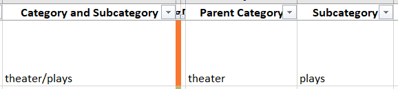
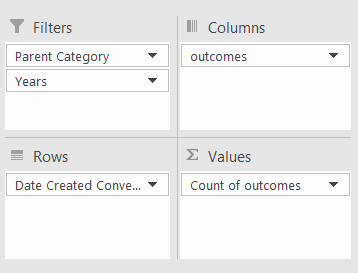
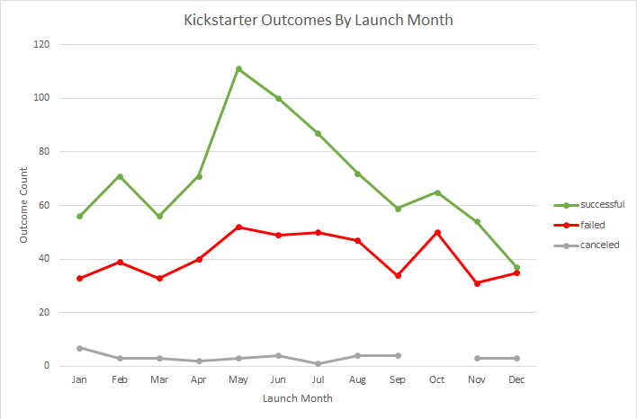
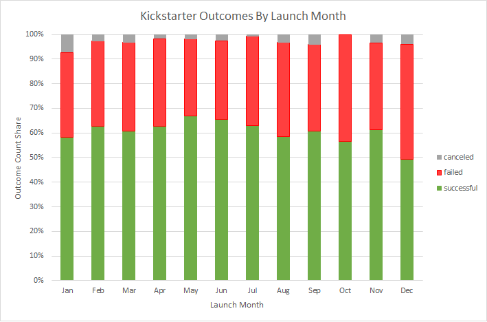
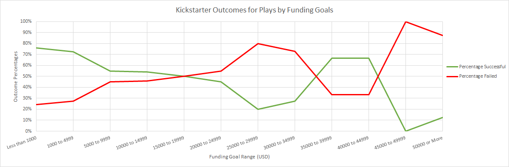
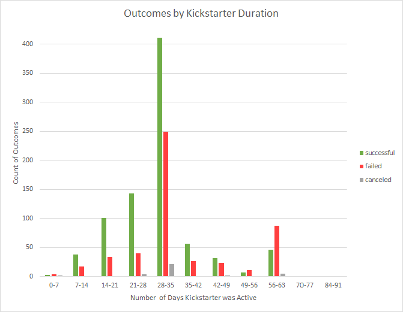
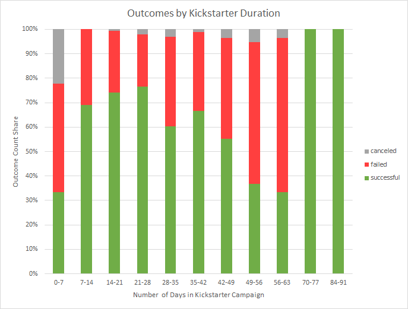

# Kickstarting with Excel

## Overview of Project
<!-- ### Purpose -->
*Cash rules everything around me* was lyrically put forth by the Wu-Tang Clan in *C.R.E.A.M.*[^1] but has likely resonated with peoples since the advent of cash in bartering. Kickstarter campaigns have enabled people to leverage the aforementioned cash around them to crowdfund opportunities; by setting a target donation amount, "backers" can donate to the project on an all-or-nothing basis (i.e. if the project's goals are not met, all money is returned), often in exchange for perks related to the project upon completion. Louise is a budding playwrite looking to crowdfund showings of her new play `Fever` and has opted for the Kickstarter model.

[^1]: *C.R.E.A.M*, <u>Enter the Wu-Tang \(36 Chambers\)</u>, **Wu-Tang Clan**. 9 Nov. 1993, Loud Records.

With a wealth of data from various Kickstarter campaigns across numerous disciplines, ranging from music to technology and food to journalism, Louise asked us budding data analysts for help on ensuring her project is primed for full funding success. Kickstarter data provided includes (non-exhaustively) the funding goals, pledged donations, outcome statuses, countries of origin, start and end dates, and descriptions of the project, in addition to the names of the projects. Herein, we present our analysis methods, conclusions, and discussions centered around theatre projects from the provided dataset, as those are most relevant to Louise's project.


## Analysis Methodologies and Challenges

All data analysis was completed in Microsoft Excel 2016 with built-in functions; that is, no user-defined functions or macros were utilized. The first step was to ensure data was easily readable. The start and end dates for the Kickstarters were provided in Unix Time, counted in the number of seconds elapsed since the Unix Epoch; while computationally favorable, they are not easily readable and were changed. To convert to a date format, the start and end dates in each `[cell]` were converted numerically from seconds to days and added to the Unix Epoch, 1 January 1970, using the built-in `DATE()` function,
```
=((([cell]/60)/60)/24)+DATE(1970,1,1) .
```

With the dates now in Excel- and human-readable formats, the duration for each kickstarter was calculated with a simple subtraction on the cells containing the start and end dates of each kickstarter. 

The provided category of each kickstarter was described as a consistently-formatted, single string subdivided into a parent- and sub-category. For ease of filtering later in the analysis, each was divided along the delimiter, `/`, using the `Text to Columns` feature, resulting in the example below (with unrelated columns minimized).



Although unused for the present analyses, two additional statistics were calculated from the provided data. With the `[target fund]` amount, `[pledged funding]`, and `[number of backers]` all provided, we calculated the funding goals expressed as percentages and the average donation amount per backer, respectively,
```
=ROUND([pledged funding]/[target fund] *100 ,0)
=IFERROR(ROUND([pledged funding]/[number of backers]] ,2) ,0) .
```

In both cases, the `ROUND()` function was used to limit the number of trailing decimals for readability to 0 and 2 decimal places, respectively. In the latter calculation, the `IFERROR()` function was used to handle a *division-by-0* error for the unfortunate cases in which a project had no backers.

Along with the country of origin for each project, the dataset includes the currency each project was launched in (e.g. Pound Sterling for projects from the United Kingdom). We have herein assumed each project's funding goals and pledged amounts have already been converted to USD and make no further conversions.


### Analysis of Outcomes Based on Launch Date

With the cyclical nature of spending, the first question we asked as data analysts was if there was a correlation between a project's funding goals being met and the time of year the Kickstarter campaign was launched. To this end, we aimed to sort our campaigns by some measure of the starting date and count how many successes, failures, and cancellations there were in each of the date measures. The built-in functionality of Excel's PivotTable provided this solution. The data was sorted into the following pivot fields:



In the image: 
1) `Parent Category` was filtered to theatre, as was our intention described above; 
2) `Years` was provided as an additional filter and taken from the start date;
3) `outcomes` in the column field enabled counting the number of "successful", "failed", and "canceled" Kickstarter campaigns by sorting on these repeated strings in the `outcomes` column;
4) `Date Created Conversion` is the human-readable date format for the campaign launch date and is provided in the rows field as the independent variable; and
5) `Count of outcomes` populates the values field as it is, explicity, the number of each outcome (described in (3)) we want as the results.

By default, Excel enables the sorting of date formats in the rows field by both year and month. For our purposes, since years are cyclical via months, and we are investigating a potential cyclical correlation to campaign success, we select only the monthly binning to populate our PivotTable.

Per Louise's specific request, a line graph was created using the built-in PivotChart feature on the PivotTable.


### Analysis of Outcomes Based on Goals

In tandem with any discussion around money comes the question of greed, which sets the stage for the other analysis conducted: is there a correlation between the Kickstarter's funding goal and its chance of success? As above, our desired results were a simple count of the number of occurances of projects' outcomes, "successful" or "failed", per unit of independent variable measurement. Louise has requested this analysis only be conducted on the narrower *plays* subcategory instead of the parent theatre category; coincidentally, no Kickstarter plays projects were canceled and we thus omit discussion of that potential outcome in this analysis.

Because each project is able to have any funding goal, it makes sense to bin the funding goals into set goal intervals; luckily, Louise provided the funding goal groupings she desired the analysis to be conducted on:
* goal \< $1k
* $1k <u>\<</u> goal \< $5k
* $5k <u>\<</u> goal \< $10k
* $10k <u>\<</u> goal \< $15k
* $15k <u>\<</u> goal \< $20k
* $20k <u>\<</u> goal \< $25k
* $25k <u>\<</u> goal \< $30k
* $30k <u>\<</u> goal \< $35k
* $35k <u>\<</u> goal \< $40k
* $40k <u>\<</u> goal \< $45k
* $45k <u>\<</u> goal \< $50k
* $50k <u>\<</u> goal

Though most funding goal bins are in increments of $5k, the first two groupings are unequal in size to the latter groupings and built-in functionalities of the PivotTable cannot be used ([see additional discussion](#challenges-and-difficulties-encountered)). To work around this issue, a self-made algorithm was developed using built-in functions, as noted earlier, using the `COUNTIFS()` function. `COUNTIFS()` is a function that will count the number of occurences a series of cells in a provided array satisifes each condition (i.e. AND operation) provided in the function call. Each call of `COUNTIFS()` allows us to thus count the number of times an outcome occurs by providing the following conditions:
1) the subcategory was listed as `plays`
2) the `outcome`, listed as 
    * i) `successful` or
    * ii) `failed`
3) the funding goal per the groupings above, tested logically with a
    * A) lower funding goal limit and
    * B) upper funding goal limit  

Testing the data on both the funding goals groupings and outcomes allows us to create a two-dimensional results array, much like a PivotTable. Each conditional is composed of an argument pair: the \[sub\]array to test and the conditional test. An example of a `COUNTIFS()` call to populate our results is below. In this example, we test the `outcome` column (F\:F) for the `Successful` string, the `subcategory` column (R\:R) for `plays` to filter the results, and the funding goal column (D\:D) to be <u>\></u>$1k *AND* <$5k.


After populating an array of the `Number Successful` and `Number Failed` counts for each funding goal bin, the counts were added together for a total number of projects in that bin and then expressed as percentages, respectively,
```
= [Number Successful] / SUM( [Number Successful], [Number Failed] )
= [Number Failed] / SUM( [Number Successful], [Number Failed] ) .
```
The percentages of the number of successful and failed campaigns were graphed as a line graph, as per Louise's specific request, as a function of the campaigns' funding goals using Excel's built-in graphing feature.


### Challenges and Difficulties Encountered

Pedagogically, there were two, albeit related, difficulties with my first foray into using PivotTables. The first difficulty was, simply put, understanding how a PivotTable works. While the ideas behind a PivotTable aren't complicated (indeed, I've made similar result tables myself in other programming languages), being told in the module instruction to simply put *these headers* into *those fields* wasn't well-suited to my learning style. Specifically, being told to put `outcomes` into both the columns field and values field without explanation was disorienting. After exploring the challenge and being forced to think about why we did the analysis as we did (for the express purpose of writing about it above), it clicked how `outcomes` in the columns field *enabled* the counting of the strings/values in the values field.

The second problem relates to how PivotTables can group the rows field data; while touched on above in the `COUNTIFS()` discussion, I arrived at the conclusion through a different train of thought. As will be [discussed below](#future-work), I wanted to correlate the Kickstarter successes to how long they ran, binning the duration by a sensible number of days. Creating the histogram bins is something I've done previously on the raw data within the histogram settings (rather than creating the bins manually like we did with `COUNTIFS()` work [above](#analysis-of-outcomes-based-on-goals)); however, I couldn't get the outcome counts to work without a PivotTable. Therein lies the issue: the PivotChart feature doesn't support creating a histogram, resulting in being unable to bin the raw data via the histogram settings.

The solution is rather simple: the grouping functionality of a PivotTable's rows field *is* the histogram binning process. This wasn't an obvious setting to find for a PivotTable novice, but a short web search provided the answer. (From there, a PivotChart bar/column graph *is* a histogram.) Having done this work after the outcomes vs goal example, I to incredulously asked myself why we didn't do this instead of a dozen `COUNTIFS()` functions, since it was so simple. The answer to that question is one briefly noted above: the first two manually-defined bins are unequal in size to the others, but a PivotTable can only group with a defined bin size. In the end, it was an insightful example to better understand the power, and shortcomings, of PivotTables.

## Results and Discussion

### Outcomes Based on Launch Dates

Below is a measure of successful and failed Kickstarter theatre projects as a function of what month the campaign was launched in, color-coded by outcome.



Immediately, we can see a few things:  
* There is a large degree of variance in successful outcomes, a moderate amount of variance in the failed outcomes, and very little variance in the number of canceled projects.
* There are more successful projects than failed projects, both of which out-number the canceled projects.
* The middle of the year has the most successful projects, specifically peaking in May.

So, Louise should start the Kickstarter campaign in May and that's done-and-dusted, correct? It turns out that is correct, but we need to think about it both in absolute and relative numbers. While there is a peak in successful outcomes in May, that's also when the number of failed projects hits a global maximum, so maybe May isn't such a safe bet. In absolute numbers, there are always more successful projects than failed, so an absolute argument would suggest any time of year is a good time to start the campaign. 

A relative argument allows us to look at the number of successful outcomes relative to the total number of started projects. As a baseline, we can calculate that, over a year, \~61\% of projects are successful. In May, 111 campaigns are successful out of a total 166 started, giving a success rate of \~67\%, an increase of \<6\% over the average. The following stacked bar chart shows the relative successes, failures, and cancellations of started projects.



From this graph, we once again see that the peak success chance occurs in May, though the difference is much less stark than the previous graph. We can, with some confidence, assert May is the best month to start a Kickstarter campaign. 

There's yet more to take out of the graphs: what's the worst month? In both absolute and relative numbers from our graphs, the answer is December. Indeed, the numbers of successful and failed campaigns in December nearly reach parity, giving December an overall success chance \<50\%. While May saw a moderate change in success chance of \<1.5 standard deviations from the average success chance, December saw a change of \>2.5 standard deviations! With greater confidence than before, we assert December is the worst month to start a Kickstarter campaign.


### Outcomes Organized by Funding Goal

The following graph showcases the relative outcomes of successful and failed Kickstarter plays campaigns against the funding goal of the campaigns.



Much like the above discussions, our answer that less-ambitious projects are fully funded at a higher rate \[than their more-ambitious counterparts\] comes with a deeper discussion. Immediately, it is evident that the highest success chances are for projects that ask for \<$5k to be funded. The lines in our graph intersect, meaning that more projects fail than succeed, somewhere around the $20k mark and the disparity between failed and successful projects continues to grow. Well, the disparity grows until just after the $30k mark and our lines start criss-crossing again, suggesting Louise could ask for a sweet spot of funding around $40k.

One potential reason the graph starts to resemble a double helix at greater funding bins is the lack of data to make a statistically sound statement. Three data points of goals ranging from $35k to $50k comprise fewer Kickstarter campaigns than the sole $30-35k datapoint. The final funding bin (<u>\></u>$50k) grouped 16 Kickstarter campaigns, whereas the penultimate grouped only a single campaign (that, evidently, failed).

To compensate for the skewed dataset, we can compare the presented success chances to an average success chance of the funding bins weighted by the number of projects in each bin. The calculation of the weighted average comes to a \~66\% success chance for plays funded through Kickstarter campaigns. This average is right on par with the large jumps in success rates from $35-45k, suggesting that setting a funding goal in this range offers no statistical benefit. Indeed, the only projects that are funded at a rate higher than the weighted average are those under $5k, as noted previously. Ipso facto, we assert Louise should set her Kickstarter campaign funding goal to under $5k.


### Further Work


At present, only two rudimentary analyses have been discussed, yet the dataset offers much more insight to be gained. For example, imagine a funding campaign that was being backed at $500 per day; if the campaign is only active for 4 days, no goal greater than $2k is likely to be reached. Clearly, the duration of the Kickstarter campaign is something to be considered. The dataset provides such opportunity derived from the start and end dates of the campaign. Below are two graphs showing absolute and relative numbers of the number of successful, failed, and canceled theatre campaigns as a function of the number of weeks the campaign is active.




While we forego extensive discussion here, a trend emerges in that campaigns appear to be more successful when they're active between 2-5 weeks with further declining success up to 8 weeks. As in our previous discussions, care must be taken when looking at the 100% success rates above 10 weeks due to the low number of Kickstarters active that long.

As noted in the [methods sections](#analysis-methodologies-and-challenges), we did calculate the funding completion percentage for each Kickstarter project. While analyses become more complicated, this is valuable information lost when correlating to binary (e.g. successful or failed outcomes) dependent variables. For example, consider our discussion on the funding outcomes by target funding goal: if the failed projects in the $5-10k grouping all reached 90\% of the funding goals, our argument that the $5-10k goals were *just slightly too ambitious* is strengthened. Conversely, if those projects all failed only 30% into their goals, something else could very well be at *play*. Likewise, campaigns that only just surpassed their low funding goal strengthen the argument that the funding goal is a strong correlation.

Of course, there's also data not included in the data set that could be beneficial. Notably, *why* were the canceled Kickstarters canceled? In the above discussion, we've largely treated failed and canceled campaigns equally; that is, the success chance is calculated against the failed *and* canceled campaigns. This makes sense in such cases where campaigns were canceled because the creators extrapolated their failure and simply canceled instead of seeing the campaign through. However, imagine the case in which the creative director lost their vision for the play: even a would-be successful campaign \-\- that should then be counted as a success in our analysis \-\- was canceled and treated incorrectly.

The most notable limitation of the dataset is synonymous with the largest asterisk of all stastical analyses: there is no causal information. In each of the above discussions, we were careful to discuss the correlations of the Kickstarter outcomes with the target goals, starting months, or even duration. We challenge the notion that a campaign seeking $1k, starting in May, and running for 4 weeks \-\- all of which are positively correlated with success \-\- will succeed if the campaign is not advertised. As another example, a play's content may not resonate with the target audience (e.g. the country of the Kickstarter) and could fail for that reason, despite doing every outlined above. As noted [previously](#overview-of-project), all of the correlations discussed herein can prime Louise's Kickstarter campaign for success, but it also relies heavily on `Fever` itself to be a *feverish* success.

